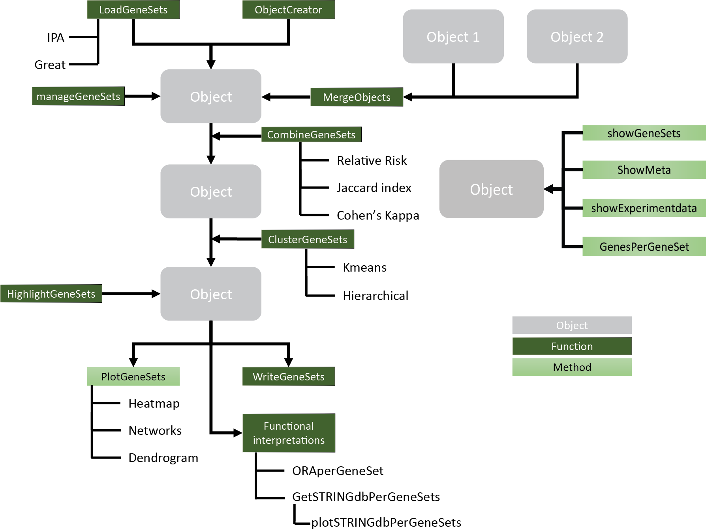

```{r setup, include=FALSE}
require(GeneSetCluster)
require(limma)
require(RColorBrewer)
require(pheatmap)
require(readxl)
require(org.Hs.eg.db)
require(org.Mm.eg.db)
require(clustree)
require(factoextra)
require(network)
require(GGally)

```

# GeneSetCluster Package example data
This is the demonstration of the R package GeneSetCluster

This is a package meant to be used to cluster together Gene-Sets from pathway tools such as Ingenuity Pathway Aanalysis (IPA) (https://www.qiagenbioinformatics.com/products/ingenuity-pathway-analysis/) and GREAT (http://great.stanford.edu/public/html/index.php), GSEA (http://software.broadinstitute.org/gsea/index.jsp) and others. Gene-Sets often appear significant when running such tools with different labels displaying different Gene-Sets.

Sometimes, interpreting the output is difficult, which can be made worse whenof several gene sets analysis are compared. 

The output data has several limitations: 
1)	Low ratio: where there are only a few genes enriched.

2)	High similarity: where the different genes sets that appear have the same genes enriched despite the different labels. 

3)	Low overlap: where the same gene set labels appear in different experimental settings but different genes are enriched. 


Consequently, it is preferable to review the gene set analysis experiment as a whole instead of investigating the many different Gene-Sets individually. Furthermore, analysing multiple gene set analysis is also improved by combining the different experiments. This package does this by taking the sets of genes of every Gene-Set and calculates the distance between them. By default this package uses a relative risk, the higher it is the greater overlap they have. This distance score is then used to cluster the Gene-Sets together.

Example data is taken from https://www.ncbi.nlm.nih.gov/geo/query/acc.cgi?acc=GSE111385

Data has been analysed with Deseq2 pipeline where the data is Transcriptome sequencing of WT and conditional-Tgfbr2 knockout microglia and CNS-repopulating monocyte-derived macrophages from C57BL/6 mouse in triplicates. The genes were picked in a comparison of uG vs Mac in both WT and KO with a 1E-06 pvalue cutoff. Genes were analysed in both IPA with the Canonical pathways and functional annotations were exported into a excel file with default settings. 
Bed files were also generated for the genes, and uploaded in GREAT with a background of the sequencing samples. All data was exported in tsv format. 

##Pipeline  


##Loading the data
Core to the pipeline is the PathwayObject. This can be generated using the automatic loader (LoadGeneSets) or with ObjectCreator. ObjectCreator needs just a vector of Gene-Sets labels, a vector with genes (as a string for each Gene-Set), a vector with each group every Gene-Set belongs to (e.g. KO or WT), it needs the Source (e.g. IPA), it needs the Type (e.g. Canonical pathways), structure (e.g. SYMBOL), and seperator (sep) (How is are the strings of the genes seperated). Gene-Sets labels, Genes and Groups need the same length. Everything else is just a single string. See example below in 1.7.

The LoadGeneSets function has all this automated, currently the LoadGeneSets function supports loading GREAT TSV files (As exported as "all data as TSV").


As well as IPA canonical pathways (exported as excel) or Functional annotations (exported as excel).


While exporting the dat afrom GREAT or IPA the data is not filtered, there for the loader filters the data. It needs a  Pvalue cutoff. In IPA the pvalue in Canonical Pathways is given as a -log10 pvalue, if the P.cutoff is larger than 1 the loader assumes that the pvalues are -log10 transformed. The  minimum number of genes (or molecules) per Gene-Set (Recommended >= 5), the data source. If GREAT was run the program needs to know  wether GREAT was run with a background. The type of data (Canonical Pathways, Functional analysis etc). for GREAT doenst matter as it runs 18 diferent types that the loader automatically assigns. 

The GREAT output is really really large, so the tool itself by default displays the top 20 ranks, this can be emulated by using the topranks. The structure e.g. SYMBOL, this is important as the combinePathways check that all the data is in the same structure and convert if neccesary, which is why it needs the Organism. Currently supported is the org.Mm.eg.db and org.Hs.eg.db packages. Last but not least is the seperator, for seperating the genes from the string.

Note the package suitable for 1 gene set analysis as well as multiple. To load 1 experiment, link to the file using file_location and supply just 1 groupnames. For multiple experiments use more than 1.

##Loading GREAT
###Loading GREAT data

```{r Great with Background load }

Great.files <- c(system.file("extdata", "MM10.GREAT.KO.uGvsMac.bed.tsv", package = "GeneSetCluster"),
                 system.file("extdata", "MM10.GREAT.KO.uGvsMac.bed_BCKGRND.tsv", package = "GeneSetCluster"),
                 system.file("extdata", "MM10.GREAT.WT.uGvsMac.bed.tsv", package = "GeneSetCluster"),
                 system.file("extdata", "MM10.GREAT.WT.uGvsMac.bed_BCKGRND.tsv", package = "GeneSetCluster"))
Great.files.bckgrnd <- Great.files[grepl("BCKGRND", Great.files)]


Great.bckgnrd.Object1 <- LoadGeneSets(file_location = Great.files.bckgrnd, 
                              groupnames= c("KO", "WT"),
                              P.cutoff = 0.05, 
                              Mol.cutoff = 5,
                              Source = "Great",
                              Great.Background = T,
                              type = "Canonical_Pathways",
                              topranks = 20,
                              structure = "SYMBOL",
                              Organism = "org.Mm.eg.db",
                              seperator = ",")


```


###Plot Overlap of Gene-Sets labels
Recommende is to inspect the labels, if there are multiple experiments the labels can be compared.
```{r Venndiagram, echo=FALSE}
par(mfrow=c(2,1))
VennDiagram(n_groups = 2, 
               Group1 = as.character(Great.bckgnrd.Object1@Data$`KO_GO Cellular Component`$Pathways), 
               Group2 =as.character(Great.bckgnrd.Object1@Data$`KO_GO Cellular Component`$Pathways), 
               names_groups = c("KO", "WT"),
               main = "Overlapping GO Cellular Component",legend = F, percentage = F )

VennDiagram(n_groups = 2, 
               Group1 = as.character(Great.bckgnrd.Object1@Data$`KO_GO Biological Process`$Pathways), 
               Group2 =as.character(Great.bckgnrd.Object1@Data$`WT_GO Biological Process`$Pathways), 
               names_groups = c("KO", "WT"),
               main = "Overlapping GO Biological Process",legend = F, percentage = F )
```

###Investigate the metafiles
Check the experiment data and the metainfo to make sure that the PathwayObject matches your experiment(s).

```{r Great with Background meta }

ShowExperimentdata(Object =Great.bckgnrd.Object1 )
ShowMeta(Object = Great.bckgnrd.Object1 )

```

###Manage Gene-Sets
Following loading of the PathwayObject the distance can be calculated in the combinePathway function. If the data is very large, data can be managed by selecting for types of interest using ManageGeneSets In this example we are interested in Disease Ontology and Go Biological Process, so we ManageGeneSets to keep those data types and remove the others. The result of the ManageGeneSets we can see using ShowExperimentdata and ShowMeta.

```{r Great with Background manage clusters}

man.Great.Object1 <- ManageGeneSets(Object = Great.bckgnrd.Object1, keep.type =c("Disease Ontology","GO Biological Process" ), exclude.type="")


ShowExperimentdata(Object =man.Great.Object1 )
ShowMeta(Object =man.Great.Object1 )
```
###Combine and cluster
Following all the setup of the pathwayObject we can now combine and cluster the Gene-Sets. The CombineGeneSets function  calculates the distance between Gene-Sets which is further used for clustering. The distance by default is a Relative Risk (RR), however if desired a user supplied functuon can also be provided (see 1.4.6). The clustering can be done in 4 ways, kmeans, Kmeans per group, hierarchical, and hierarchical per group. depending on the data different clustering methods work better. As for how many clusters your data requires, is depended on your data. It is recommended that you use a trial and error approach to detereming the optimal number of clusters.

Combine object gives you the option to display a condensed version of the data or an expanded one with groups being compared or seperated. ClusterGeneSets furthermore gives you the option to filter for unique molecular signatures. This can be usefull for experiments where the same gene signature appears a lot. 

Advised is to not filter for unique molecular signature when the display is set to Condensed. This will lead to a loss of information. Advised is to set display to Expanded before filtering for unique molecular signatures.

```{r Great with Background combine and cluster condensed}

man.Great.Object2 <- CombineGeneSets(Object = man.Great.Object1, 
                                     combineMethod = "Standard",
                                     display = "condensed")

OptimalGeneSets(object = man.Great.Object2, method = "silhouette", cluster_method = "kmeans", main="man.Great.Object1",max_cluster = 10)
```


```{r Great with Background combine and cluster Expanded}
man.Great.Object3 <- ClusterGeneSets(Object = man.Great.Object2, 
                                 clusters = 5, 
                                 method = "kmeans", 
                                 order = "cluster", 
                                 molecular.signature = "All")

man.Great.Object2.expanded <- CombineGeneSets(Object = man.Great.Object1, 
                                     combineMethod = "Standard",
                                     display = "Expanded")
man.Great.Object3.expanded <- ClusterGeneSets(Object = man.Great.Object2.expanded, 
                                 clusters = 5, 
                                 method = "kmeans", 
                                 order = "cluster", 
                                 molecular.signature = "All")
```

###Plot The great RR with background clusters
Using the PlotPathways function on the PathwayObject plots a heatmap with a bar for Group and cluster, allowing you to identify the groups. If desired you can add the annotation of the genes and Gene-Sets names using annotation.mol. Also the data is scaled. When there are very large Gene-Sets involved the scales of the RR can be very large. E.g. some Gene-Sets have a RR of >750 while other small ones are ~30. This makes it difficult to distuingish the different clusters. Use the RRmax function to scale the RR to the max desired. 


```{r plotPathways, echo=FALSE}
PlotGeneSets(Object =man.Great.Object3, fontsize = 3,
            legend = T,
            annotation.mol=F,
            main="Great_Background clustered with Kmeans without scaling \n Disease Ontology and GO Biological Process")

PlotGeneSets(Object =man.Great.Object3, fontsize = 3,
            legend = T,
            annotation.mol=F,
            RR.max = 60,
            main="Great_Background clustered with Kmeans \n Disease Ontology and GO Biological Process")


PlotGeneSets(Object =man.Great.Object3.expanded, fontsize = 3,
            legend = T,
            annotation.mol=F,
            RR.max = 60,
            main="Great_Background clustered with Kmeans \n Disease Ontology and GO Biological Process")


```
###Plot The great RR network
Using the PlotGeneNetworks function on the PathwayObject plots a network. Plotting the network shows the relationship of Gene set with other gene sets in context with the minimum number of distance between them.


```{r plotPathway networks, echo=FALSE}
PlotGeneNetworks(Object =man.Great.Object3,labels = F, RRmin = 0)
PlotGeneNetworks(Object =man.Great.Object3,labels = F, RRmin = 5)
PlotGeneNetworks(Object =man.Great.Object3,labels = F, RRmin = 10)
PlotGeneNetworks(Object =man.Great.Object3.expanded,labels = F, RRmin = 0)
PlotGeneNetworks(Object =man.Great.Object3.expanded,labels = F, RRmin = 5)
PlotGeneNetworks(Object =man.Great.Object3.expanded,labels = F, RRmin = 10)
PlotGeneNetworks(Object =man.Great.Object3.expanded,labels = T, RRmin = 10)


```


##IPA
###Loading IPA data
When Loading IPA data we seperate between Canonical Pathways and Functional Anotations, as the source files have a different structure. 

```{r load IPA}


IPA.files <- c(system.file("extdata", "MM10.IPA.KO.uGvsMac.Canonical_pathways.xls", package = "GeneSetCluster"),
                 system.file("extdata", "MM10.IPA.WT.uGvsMac.Canonical_pathways.xls", package = "GeneSetCluster"),
                 system.file("extdata", "MM10.IPA.KO.uGvsMac.Functional_annotations.xls", package = "GeneSetCluster"),
                 system.file("extdata", "MM10.IPA.WT.uGvsMac.Functional_annotations.xls", package = "GeneSetCluster"))
canonical.files <- IPA.files[grep("Canonical", IPA.files)]

IPA.object1 <- LoadGeneSets(file_location = canonical.files, 
                            groupnames= c("Canonical.KO", "Canonical.WT"),
                            P.cutoff = 1.3, 
                            Mol.cutoff = 5,
                            Source = "IPA",
                            type = "Canonical_Pathways",
                            structure = "SYMBOL",
                            seperator = ",")

```
###Plot Overlap of pathway labels
Using the VennDiagram it is possible to see the overlap between the different labels in the IPA canonical output.

Nearly all the labels from KO are in the WT experiment. Nonetheless the labels are not as important as the genes which cause this gene set to be enriched.


```{r Venndiagram IPA Pathways, echo=FALSE}
VennDiagram(n_groups = 2, 
               Group1 = as.character(IPA.object1@Data$Canonical.KO$Pathways), 
               Group2 =as.character(IPA.object1@Data$Canonical.WT$Pathways), 
               names_groups = c("KO", "WT"),
               main = "Overlapping IPA pathway labels",legend = F, percentage = F )


```
###IPA canonical meta
Here we can see the overlap between the different labels in the IPA canonical output


```{r meta IPA Pathways}
ShowExperimentdata(Object =IPA.object1 )
ShowMeta(Object =IPA.object1 )


```
###IPA Combining and clustering canonical Gene-Sets
Here we combine and cluster the IPA output using kmeans.

```{r combine and cluseter IPA Pathways}


IPA.object2 <- CombineGeneSets(Object = IPA.object1,
                               display = "Expanded")
OptimalGeneSets(object = IPA.object2, method = "silhouette", cluster_method = "kmeans", main="IPA.object",max_cluster = 15)
IPA.object3 <- ClusterGeneSets(Object = IPA.object2, 
                               clusters = 12, 
                               method = "kmeans")

```
###Highlighting genes
When running the data we can ask it wether a certain set of genes ar emore appearing in certain clusters than others. To view this we can take a gene set and highlight it in the data. In the plot an extra bar will appear where the higher the overlap the darker blue it becomes. 

```{r Highlight IPA Canonical Pathways}

#Highlighting Redox Genes
system.file("data", "Redox.genes.rda", package = "testdat")
IPA.object3.highlight <- HighlightGeneSets(Object = IPA.object3, 
                                           highligt.genes = Redox.genes, 
                                           name = "Ros")

```
###Plot The IPA canonical RR with highlights clusters
These highlighted genes add a bar with highlight to the plot

```{r              with highlight, echo=FALSE}

PlotGeneSets(Object =IPA.object3, fontsize = 3,
            legend = T,
            annotation.mol=F,
            RR.max = 60,
            main="IPA canonical")

PlotGeneSets(Object =IPA.object3.highlight, fontsize = 3,
            legend = T,
            annotation.mol=F,
            RR.max = 60,
            main="IPA canonical with highlights clusters")


PlotGeneNetworks(Object =IPA.object3,labels = F, RRmin = 0)
PlotGeneNetworks(Object =IPA.object3,labels = F, RRmin = 5)
```

THis highlight can also be seen using ShowGeneSets. Note the ShowGeneSets returns a data.frame, use of head(), tail() etc to not overwhelm the console with data.

```{r display data with highlight, echo=FALSE}

ShowGeneSets(IPA.object3.highlight)[1:5,]

```


###Distance calculations using user supplied combinations functions
calcuating the distance between Gene-Sets is by default by calcuting the RR. However in certain cases the user wants to use a different function to comine the data. The function alows to use a user supplied functions. e.g. the jaccard similarity index can be used, this calculated the overlap between Gene-sets. Jaccard is quite suitable for larger Gene-Sets but biased in smaller Gene-Sets. 

```{r User supplied distance calculations}

jaccard <- function(A,B)
{
  #The Jaccard similarity index (sometimes called the Jaccard similarity coefficient) compares members 
  #for two sets to see which members are shared and which are distinct. 
  #It's a measure of similarity for the two sets of data, with a range from 0% to 100%. 
  #The higher the percentage, the more similar the two populations.
  
  M <- sum(as.vector(A) == 1 & as.vector(B) == 1)
  A.c <- sum(as.vector(A) == 1 & as.vector(B) == 0)
  B.c <- sum(as.vector(A) == 0 & as.vector(B) == 1)
  J <- M/(A.c+B.c+M)
  return(J)
}


IPA.Object.J <- CombineGeneSets(Object = IPA.object1, combineMethod = "Jaccard", combineMethod.supplied = jaccard)
IPA.Object.J <- ClusterGeneSets(Object = IPA.Object.J, 
                                                clusters = 4, 
                                                method = "kmeans", 
                                                order = "group")

PlotGeneSets(Object = IPA.Object.J, fontsize =5,
            legend = T,
            annotation.mol=F,
            main="Jaccard distance", RR.max = 50)
```


##Loading the IPA functional annotations 
Using GeneSetCluster to load Functional annotations is possible by adding Functional_annotations to type.
Specify in the loader that these are functional annotations and set the Pvalue cutoff accordingly. Using default settings Canonical pathways are exported with -log10 transformed Pvalues, meaning the larger is more significant, while functional annotations are exported with untransformed pvalues. 


```{r load IPA functional annotations}

################################################
#-------IPA on Functional_annotations----------#
################################################


functional.files <- IPA.files[grep("Functional", IPA.files)]

IPA.Functional.object1 <- LoadGeneSets(file_location = functional.files, 
                                 groupnames= c("Functional.KO", "Functional.WT"),
                                 P.cutoff = 0.05, 
                                 Mol.cutoff = 5,
                                 Source = "IPA",
                                 type = "Functional_annotations",
                                 structure = "SYMBOL",
                                 seperator = ",")
```

###Plot Overlap of functions labels
Using VennDiagram we can see the overlap between the different labels in the IPA functional output. Many functional annotations labels are shared while the Canonical Pathways showed different results. 

```{r Venndiagram IPA functions}
VennDiagram(n_groups = 2, 
               Group1 = as.character(IPA.Functional.object1@Data$Functional.KO$Pathways), 
               Group2 =as.character(IPA.Functional.object1@Data$Functional.WT$Pathways), 
               names_groups = c("KO", "WT"),
               main = "Overlapping IPA functions labels",legend = F, percentage = F )


```
###IPA functional meta
Here we can see the overlap between the different labels in the IPA functional output. They should reflect the experiments accordingly. 

```{r meta IPA functional}

ShowExperimentdata(Object =IPA.Functional.object1 )
ShowMeta(Object = IPA.Functional.object1 )


```

###IPA Combining and clustering functional Gene-Sets

This functional object works the same as the rest.
```{r combine and cluseter IPA functional Gene-Sets}

IPA.Functional.object2 <- CombineGeneSets(Object = IPA.Functional.object1, 
                                          display = "Expanded")
OptimalGeneSets(object = IPA.Functional.object2, method = "Gap", cluster_method = "kmeans", main="IPA.Functional.object2",max_cluster = 15)
IPA.Functional.object3 <- ClusterGeneSets(Object = IPA.Functional.object2, 
                               clusters = 8, 
                               method = "kmeans")

```
###Plot The IPA functional RR
Plotting the different Pathways shows that it works the same to investigate the different clusters. 

```{r plotPathways with functional, echo=FALSE}

PlotGeneSets(Object = IPA.Functional.object3, 
            fontsize = 3,
            legend = T,
            annotation.mol=F,
            RR.max = 60,
            main="IPA functional with kmeans clusters")
```

##Merging the canonical pathways and functional annotations
When there are 2 different PathwayObjects, because of different loadings or different types, the pipeline allows for merging together multiple PathwayObjec into an merged object.  If multiple objects need to be merged the function has to be run several times. It warns when different tools or types are merged.


```{r merge datasets IPA}

Ipa.merged.object1 <- MergeObjects(Object.1 =IPA.object1, 
                                    Object.2 = IPA.Functional.object1)


ShowExperimentdata(Object =Ipa.merged.object1 )
ShowMeta(Object = Ipa.merged.object1 )

```
###Combine and cluster merged data
Following merging the pipeline combines and clusters the results. Of note here is of course the time it takes growths exponentially with larger datasets, so the merged data takes longer than the seperate data sets.

```{r merge datasets combine and cluster IPA}

Ipa.merged.object2 <- CombineGeneSets(Object = Ipa.merged.object1,
                                      display="Expanded")

Ipa.merged.object3 <- ClusterGeneSets(Object = Ipa.merged.object2, 
                                          clusters = 14, 
                                          method = "kmeans")

```


###Merged Data in Object3
Now the data sets are merged and compared. 
These are completely normal PathwayObjects now. So we can also highlight the object same as we done before.

```{r highlight dataset merged}
Ipa.merged.object3.highlight <- HighlightGeneSets(Object = Ipa.merged.object3, highligt.genes = Redox.genes, name = "Ros")

```

###Plot The IPA merged RR

We can plot these results from the highlighted merged 12 kmeans clusters.

In the heatmap with the expanded display clearly shows the difference between the different clusters. 


```{r plotPathways with merged, echo=FALSE}

PlotGeneSets(Object =Ipa.merged.object3.highlight, fontsize = 3,
            legend = T,
            annotation.mol=F,
            RR.max = 60,
            main="IPA merged RR with highlights clusters")
```


##Export the combined pathways and RR

Exporting the files is done using the WriteGeneSets. It writes it in the folder assigned to file_location and it takes the name of Name and writes it into a CSV file with seperation of ";", to make it readable by Excel.


```{r write merged output to file}

WriteGeneSets(Object = Ipa.merged.object3.highlight, file_location = getwd(), name = "Ipa.merged.object3.highlight", write = "Both")
```


##Creating object with custom table
When data wasnt run in GREAT or IPA the pipeline can still be used. In fact it doesnt neccesary need to be proper pathways. The thing the code needs is a group, a name, and name content. Plus some meta info. It is possible to simulate a dataset.


###Creating random pathway data

Simulation starts with generating a random data set. Assign the names as Pathway_1 etc. With the genes inside just being Gene_1 to Gene_200.
```{r Creating random pathway data}

Test.object <- matrix(data = NA, nrow = 50, ncol = 3)
colnames(Test.object) <- c("Pathways", "Genes", "Group")
Test.object[,"Pathways"] <- paste("Pathway", 1:nrow(Test.object), sep = "_")
Test.object[1:25,"Group"] <- "Group1"
Test.object[26:50,"Group"] <- "Group2"


#Create a random amount of genes per pathway
random.gene <- function()
{
  genenames <- paste("Gene", 1:200, sep = "_")#this gives 200 gene names
  genes <- round(runif(n = runif(n = 1,min =  7,max = 20), min = 1, max = 200), digits = 0)#This gives between 7 and 20 random whole numbers
  genes <- unique(genes)#remove duplicate numbers             
  genes <- genenames[genes]#get random genesnames
  return(genes)
}

for(i in 1:nrow(Test.object))
{
  Test.object[i, "Genes"] <- paste(random.gene(), collapse=",")#Collapse the genes into a string
}

head(Test.object)
```


###Creating object with custom table
This simulated dataset is then inputted into the ObjectCreator to generate a proper PathwayObject. 
```{r creating random pathway Object}

Test.object1 <- ObjectCreator(Pathways = Test.object[,1], 
                              Molecules = Test.object[,2], 
                              Groups = Test.object[,3],
                              Source = "Random",
                              Type = "Random",
                              structure = "SYMBOL",organism ="Org.HS.eg.db",
                              sep = ",")#neccesay to seperate the different genes for combinations.
ShowExperimentdata(Object = Test.object1)
ShowMeta(Object = Test.object1)
```


###Creating Combine and clustering custom object
The combining and clustering works exactly the same as autoloaded objects.

```{r combining and clustering custom Object}
Test.object2 <- CombineGeneSets(Object = Test.object1)
Test.object3 <- ClusterGeneSets(Object = Test.object2, 
                                                clusters = 4, 
                                                method = "kmeans", 
                                                order = "group")

```


###Plotting custom Object
The plotting works the same as any other object3. 
Note there are few clusters visible because the data is random. 

```{r plotting random Object}
PlotGeneSets(Object = Test.object3, fontsize =5,
            legend = T,
            annotation.mol=F,
            main="Random genes", RR.max = 50)

```

